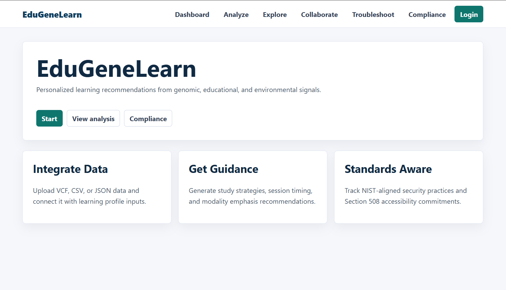
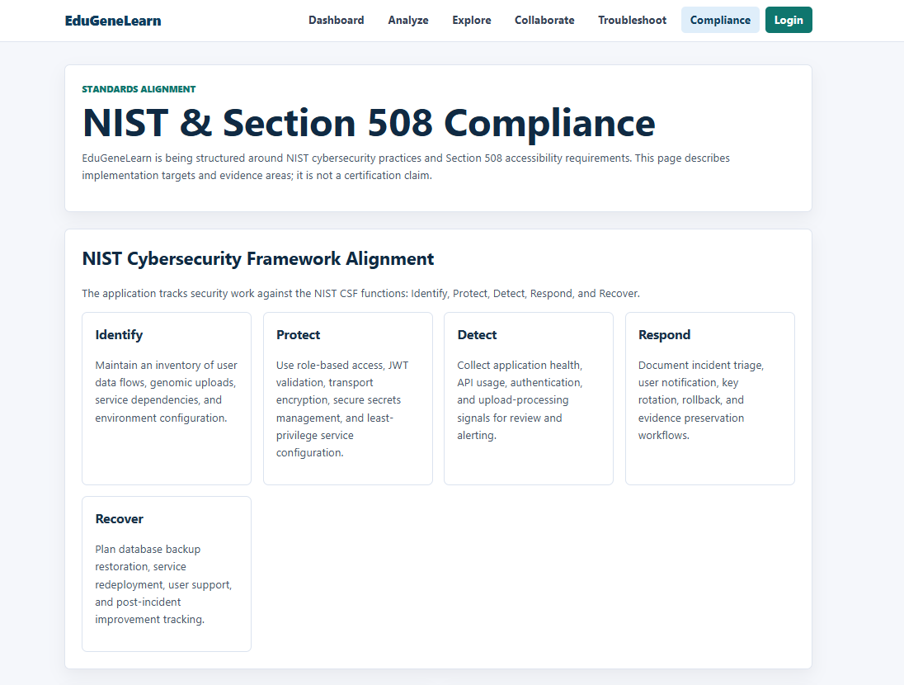
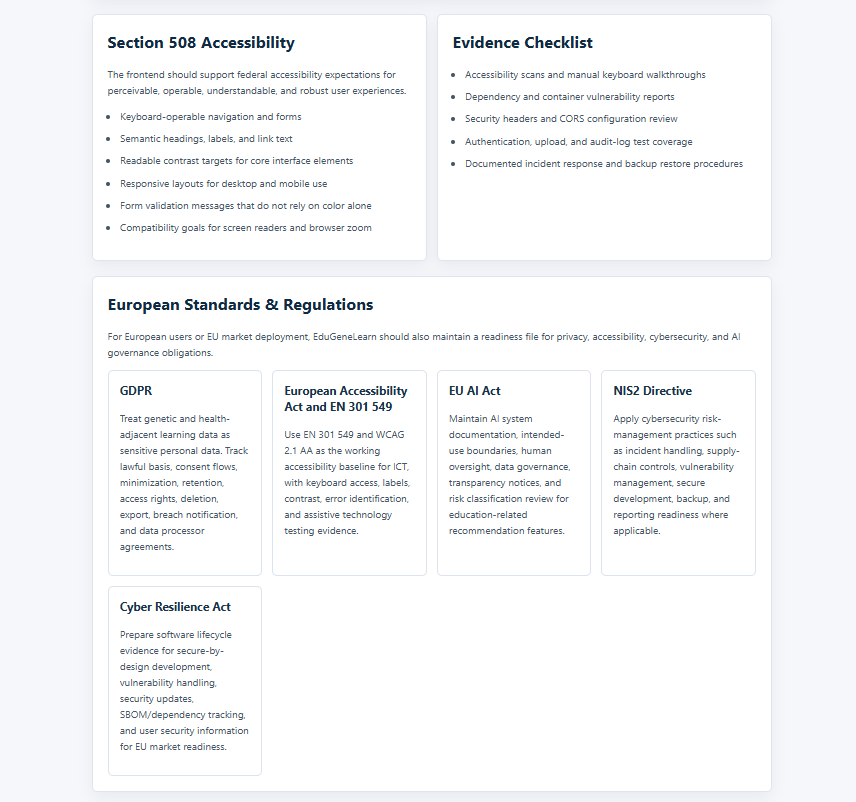
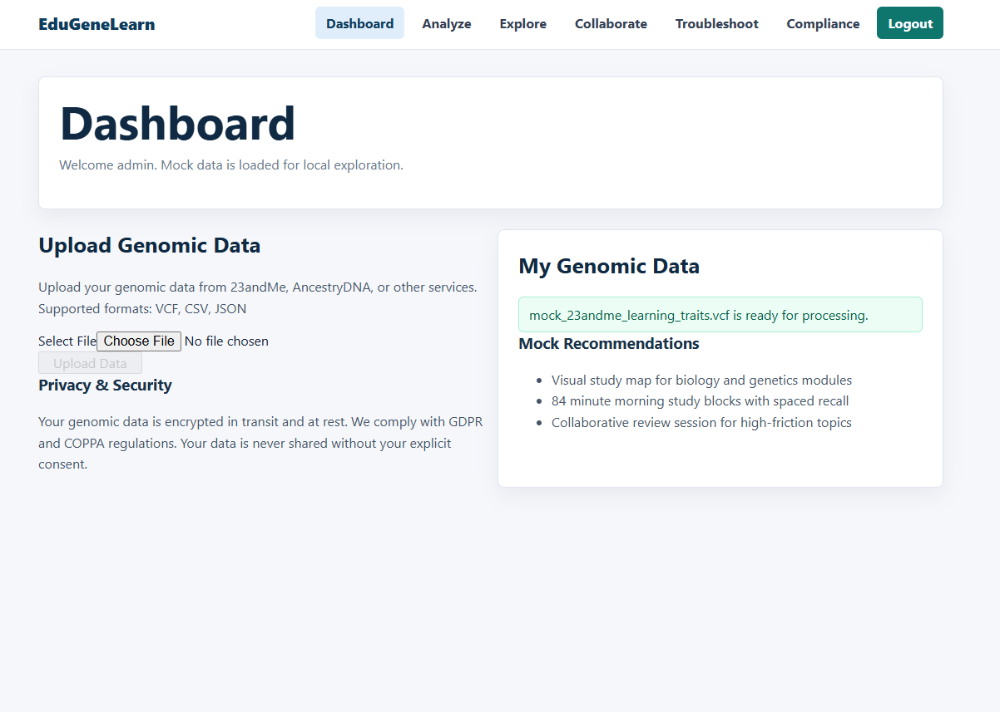
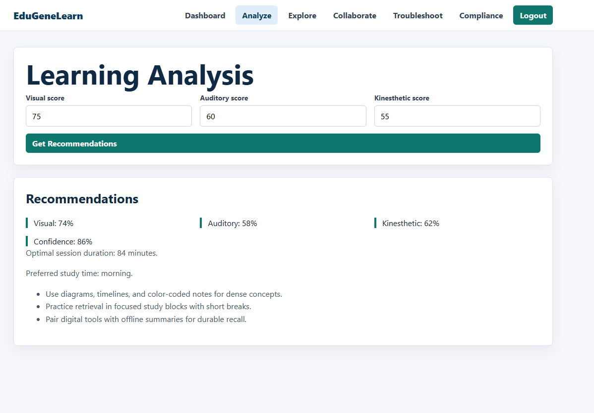
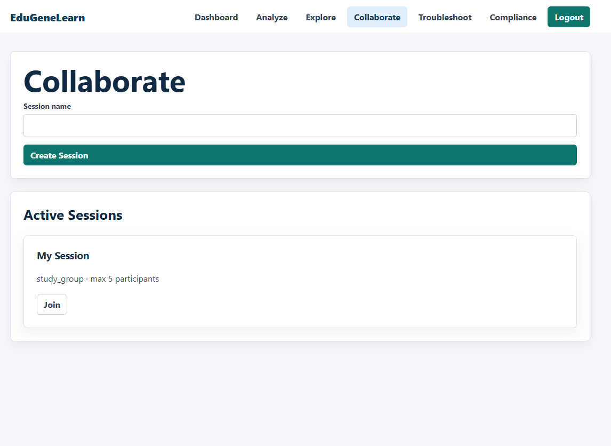
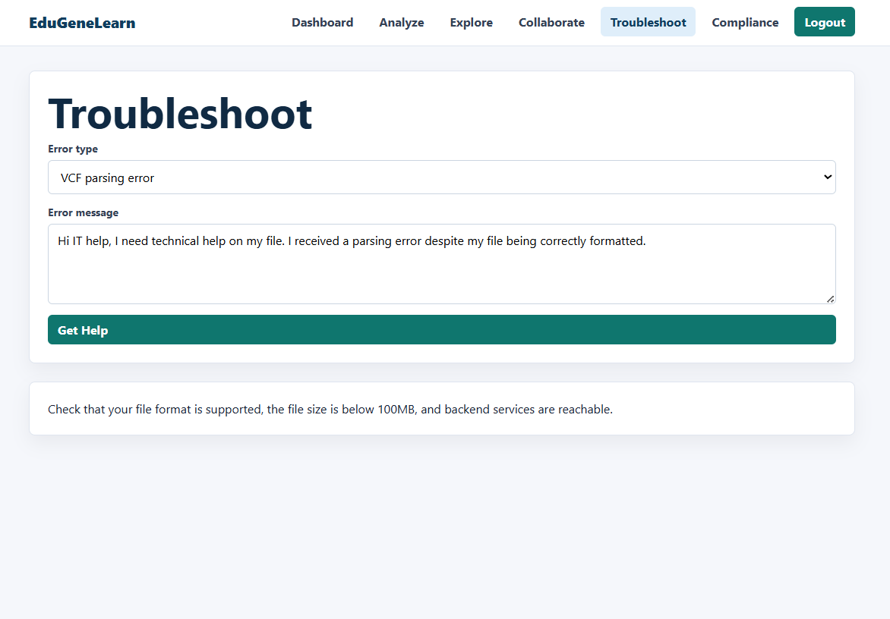

# EduGeneLearn

EduGeneLearn is a modular full-stack prototype for exploring how genomic, educational, and environmental signals could support personalized learning recommendations. The repository includes a React/Vite frontend, Spring Boot services, Python FastAPI services, PostgreSQL/Redis storage, Docker Compose infrastructure, and mock-friendly local workflows.

The current app is designed to be runnable for development and demonstrations. Some advanced platform capabilities, such as enterprise SSO/MFA, real collaboration backends, and production certification workflows, are represented as configuration, UI, test, or roadmap areas rather than complete production implementations.

## Screenshots















## Current Capabilities

- **Frontend application**: Home, login, dashboard, analyze, explore, troubleshoot, collaborate, and compliance pages.
- **Mock login for local development**: Use `admin` / `Admin123!` when backend auth is unavailable.
- **Genomic upload flow**: Frontend upload UI plus a Spring Boot learning-integrator service for VCF, CSV, and JSON genomic data handling.
- **AI recommendation service**: FastAPI + PyTorch service for learning profile predictions from genomic, educational, and environmental inputs.
- **LLM assistance service**: FastAPI service with mock Hugging Face/xAI provider paths for learning, upload, visualization, and troubleshooting prompts.
- **Compliance readiness page**: NIST Cybersecurity Framework, Section 508, GDPR, European Accessibility Act / EN 301 549, EU AI Act, NIS2, and Cyber Resilience Act tracking content.
- **Container orchestration**: Docker Compose for PostgreSQL, Redis, API gateway, Java services, Python services, frontend, NGINX, Prometheus, and Grafana.
- **Kubernetes starter manifests**: Namespace, PostgreSQL, API gateway, and frontend manifests under `infra/kubernetes`.

## Architecture

```text
React/Vite frontend (3000)
        |
        v
Spring Cloud API Gateway (8080)
        |
        +-- learning-integrator (8081): genomic data upload and processing
        +-- user-session (8083): user model, JWT utility, auth foundation
        +-- ai-model (8000): learning profile prediction service
        +-- llm-service (8085): LLM query and troubleshooting service
        |
        +-- PostgreSQL (5432)
        +-- Redis (6379)
```

The gateway also contains reserved routes for visualization and collaboration APIs. Those services are not currently included in `docker-compose.yml`; the frontend provides local/mock collaboration and exploration experiences for development.

## Tech Stack

- **Frontend**: React 18, Vite, React Router, Axios, Three.js, Recharts, Socket.IO client, custom CSS.
- **Java backend**: Java 17, Spring Boot 3, Spring Cloud Gateway, Spring Security, Spring Data JPA, JJWT.
- **Python services**: Python 3.10+, FastAPI, PyTorch, NumPy, Redis client.
- **Data stores**: PostgreSQL 15, Redis 7.
- **Infrastructure**: Docker, Docker Compose, NGINX, Prometheus, Grafana, Kubernetes manifests.
- **Testing/tooling**: ESLint, Jest, Playwright, Maven, pytest.

## Prerequisites

- Git
- Node.js 18+
- Java 17+
- Python 3.10+; Python 3.13 also works for the local checks used in this repo
- Docker Compose or Podman Compose for full-stack container runs

## Quick Start: Frontend Mock Mode

This is the fastest way to run the application UI without backend services.

```bash
cd frontend
npm install
npm run dev
```

Open `http://localhost:3000`.

Demo credentials:

```text
Username: admin
Password: Admin123!
```

Useful routes:

- `http://localhost:3000/`
- `http://localhost:3000/login`
- `http://localhost:3000/dashboard`
- `http://localhost:3000/analyze`
- `http://localhost:3000/explore`
- `http://localhost:3000/troubleshoot`
- `http://localhost:3000/collaborate`
- `http://localhost:3000/compliance`

## Full Stack with Docker Compose

```bash
cp .env.example .env
docker-compose up --build
```

Main endpoints:

- Frontend: `http://localhost:3000`
- API Gateway: `http://localhost:8080`
- Learning Integrator: `http://localhost:8081`
- User Session: `http://localhost:8083`
- AI Model: `http://localhost:8000`
- LLM Service: `http://localhost:8085`
- Prometheus: `http://localhost:9090`
- Grafana: `http://localhost:3001`

Before using real data or public deployments, update `.env` secrets such as `POSTGRES_PASSWORD`, `JWT_SECRET`, API keys, and Grafana credentials.

## Local Development Commands

Frontend:

```bash
cd frontend
npm install
npm run lint
npm run build
npm run dev
```

Java services:

```bash
cd backend/learning-integrator
mvn test
mvn spring-boot:run

cd ../user-session
mvn test
mvn spring-boot:run

cd ../api-gateway
mvn test
mvn spring-boot:run
```

Python services:

```bash
cd ai-model
pip install -r requirements.txt
uvicorn learning_predictor:app --reload --port 8000

cd ../backend/llm-service
pip install -r requirements.txt
uvicorn llm_service:app --reload --port 8085
```

## Testing

Frontend:

```bash
cd frontend
npm run lint
npm run build
npm test
npm run test:e2e
```

Backend:

```bash
cd backend/learning-integrator
mvn test

cd ../user-session
mvn test

cd ../api-gateway
mvn test
```

Python:

```bash
cd ai-model
pytest

cd ../backend/llm-service
pytest
```

The Playwright E2E suite is designed to run in mock mode for local development. See `frontend/tests/e2e/STANDALONE_TESTING.md`.

## Compliance Readiness

The Compliance page is an implementation readiness tracker, not a legal certification. It currently documents control areas for:

- **NIST Cybersecurity Framework**: Identify, Protect, Detect, Respond, and Recover.
- **Section 508**: Keyboard access, semantic structure, readable contrast, responsive behavior, and assistive technology support.
- **GDPR**: Special category data handling, consent, purpose limitation, minimization, retention, access, and deletion workflows.
- **European Accessibility Act / EN 301 549**: Accessible digital service expectations for European markets.
- **EU AI Act**: Education-related AI governance, transparency, documentation, risk management, and human oversight readiness.
- **NIS2 Directive**: Cybersecurity governance, incident handling, continuity, and supplier risk themes.
- **Cyber Resilience Act**: Secure-by-design, vulnerability handling, and lifecycle security considerations for digital products.

Any deployment that handles real genomic or student data should receive legal, privacy, accessibility, and security review before production use.

## Security Notes

- Do not commit real `.env` secrets.
- Rotate `JWT_SECRET`, database passwords, API keys, and Grafana credentials before deployment.
- Treat genomic data as highly sensitive personal data.
- Add TLS, hardened headers, audit logging, retention policies, backup policies, and incident response playbooks before production use.
- The repo contains readiness language for GDPR/COPPA/Section 508/NIST/EU obligations; it does not by itself make a deployment compliant.

## Documentation Map

- `QUICKSTART.md`: setup paths for frontend mock mode, Docker Compose, and local services.
- `PROJECT_STRUCTURE.md`: current repo layout and service inventory.
- `PODMAN_SETUP.md`: Podman-focused setup notes.
- `TESTING_WITHOUT_INFRASTRUCTURE.md`: mock-mode validation workflow.
- `frontend/tests/e2e/README.md`: Playwright test coverage and commands.

## License

This project is dual-licensed:

- **Non-profit use**: Free and open-source; see `LICENSE`.
- **Commercial use**: Requires a 6% gross income license fee; see `LICENSE`.

For commercial licensing inquiries, contact `Sekacorn@gmail.com`.

## Author

Created by sekacorn.
